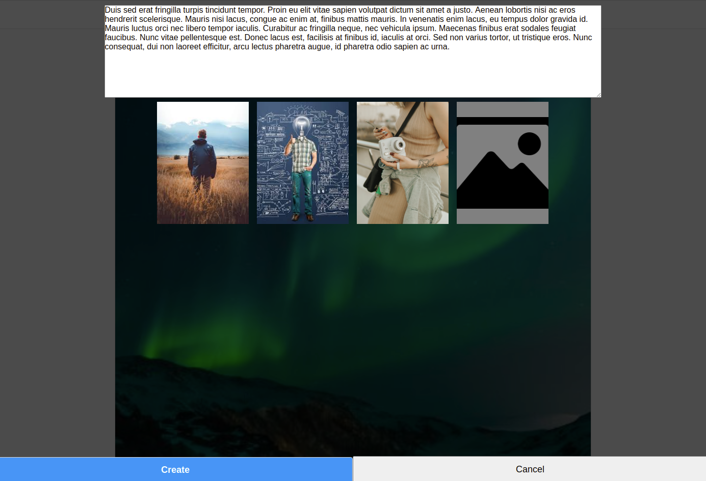
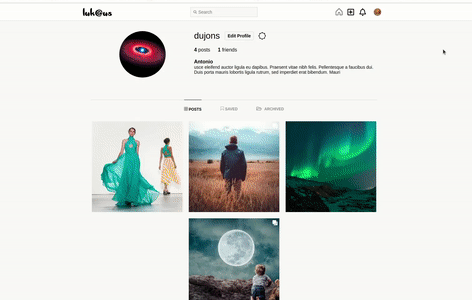

[![LinkedIn][linkedin-shield]][linkedin-url]


<!-- PROJECT LOGO -->
<br />
<p align="center">


  <h1 align="center">Social Network with Laravel </h1>
  <p align='center'>
  <a href='https://tonijorda.com/projects/SocialNetworkLaravel/public/'>View Demo</a>
  </p>
</p>


<!-- ABOUT THE PROJECT -->
## About The Project
Social network, build with Laravel 8, that implements main functionalities such as: 
    -creating/editing/deleting posts with many images
    -comment posts
    -add friends
    -block users
    -tag users on comments and posts
    -set private account
    -archive posts
    -save posts


- Main page

<br>
- Create post


<br>

- User profile

<br>

- Search
### Built With

- Laravel 8
- PHP 7.4
-Javascript
- CSS
- HTML


<!-- GETTING STARTED -->
###  Getting Started


<!-- GETTING STARTED -->
###  Getting Started


1. Clone the repo
   ```sh
   git clone https://github.com/Skebard/Social-Network-Laravel.git
   ```
2. Install composer dependencies
```
composer install
```
3. Install NPM dependencies
```
npm install
```
4. Create a copy of your .env file
```
cp .env.example .env
```
4.Set up your database credentials in the .env file.
```
DB_CONNECTION=mysql
DB_HOST=yourHost
DB_PORT=3306
DB_DATABASE=yourDatabaseName
DB_USERNAME=yourUsername
DB_PASSWORD=yourPassword
```
5. Generate an app encryption key
```
php artisan key:generate
```
6. Create an empty database. Make sure that the name in the .env file corresponds with the created database.
7.Migrate the database
```
php artisan migrate
```

7. You can as well seed the database. When seeding you can see some errors due to the relationships between tables
```
php artisan db:seed
```
8.If you want to run a specific seeder use the following command changing UserSeeder for your desired seeder
```
php artisan db:seed --class=UserSeeder
```

9. Run the server. You can use artisan like this:
```
php artisan serve
```

10. Finally comment that when uploading files you might encounter problems if you php.info is not well configured.


<!-- CONTRIBUTING -->
### Contributing

Contributions are what make the open source community such an amazing place to be learn, inspire, and create. Any contributions you make are **greatly appreciated**.

1. Fork the Project
2. Create your Feature Branch (`git checkout -b feature/AmazingFeature`)
3. Commit your Changes (`git commit -m 'Add some AmazingFeature'`)
4. Push to the Branch (`git push origin feature/AmazingFeature`)
5. Open a Pull Request


[linkedin-shield]: https://img.shields.io/badge/-LinkedIn-black.svg?style=for-the-badge&logo=linkedin&colorB=555
[linkedin-url]: http://www.linkedin.com/in/tjorda